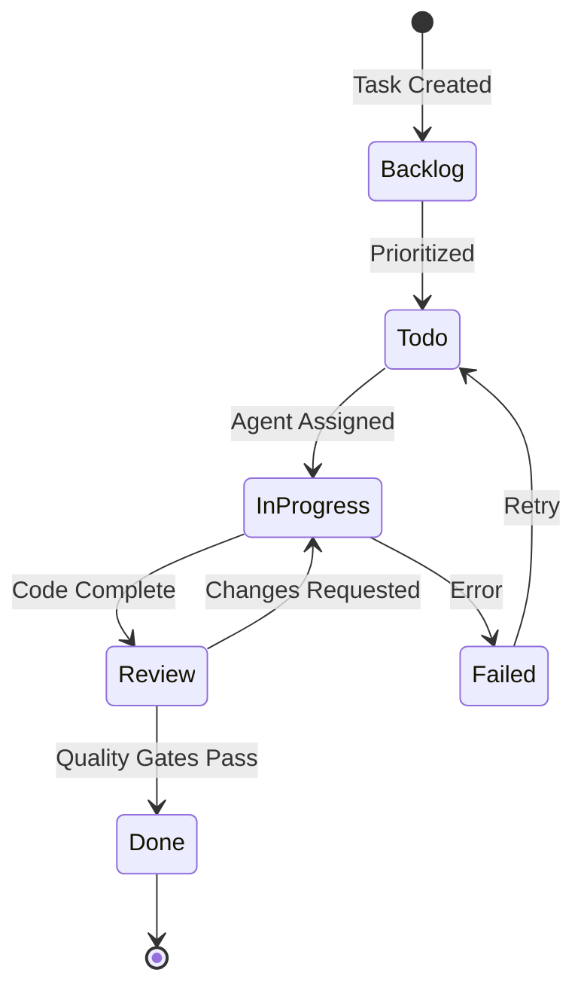
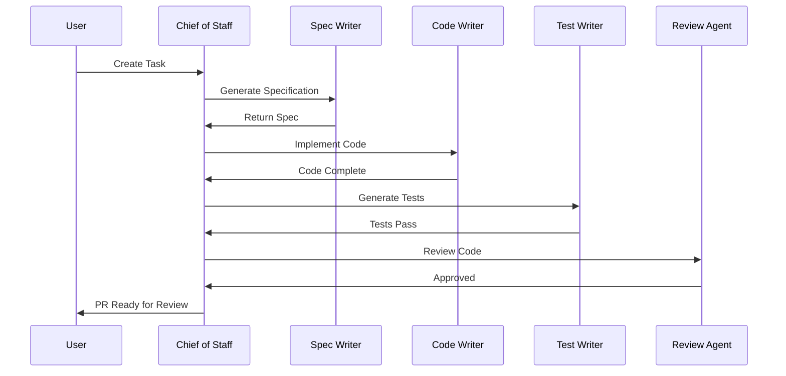

# 🏗️ System Architecture

## High-Level Overview

```
┌─────────────────────────────────────────────────────────────────┐
│                      DARK FACTORY SYSTEM                       │
├─────────────────────────────────────────────────────────────────┤
│                                                                 │
│  ┌──────────────┐  ┌──────────────┐  ┌──────────────┐          │
│  │   Frontend   │  │   Backend    │  │   Database   │          │
│  │   (React)    │◄►│  (Node.js)   │◄►│   (SQLite)   │          │
│  │  Dashboard   │  │  + Express   │  │              │          │
│  └──────────────┘  └──────┬───────┘  └──────────────┘          │
│                           │                                     │
│                  ┌────────▼────────┐                            │
│                  │  Agent Manager  │                            │
│                  │ (Orchestrator)  │                            │
│                  └────────┬────────┘                            │
│                           │                                     │
│    ┌──────┬───────┬───────┼───────┬───────┬──────┐             │
│    ▼      ▼       ▼       ▼       ▼       ▼      │             │
│  ┌────┐ ┌────┐ ┌────┐ ┌────┐ ┌────┐ ┌────┐      │             │
│  │MAIN│ │SPEC│ │CODE│ │TEST│ │REVW│ │DOC │      │             │
│  │AGNT│ │AGNT│ │AGNT│ │AGNT│ │AGNT│ │AGNT│      │             │
│  └────┘ └────┘ └────┘ └────┘ └────┘ └────┘      │             │
│  Chief  Spec   Code   Testing Review Document    │             │
│  of     Writer Writer                            │             │
│  Staff                                           │             │
│                                                                 │
│  ┌──────────────────────────────────────────────────────┐      │
│  │                   Skills Layer                       │      │
│  ├──────────┬──────────┬──────────┬──────────┬─────────┤      │
│  │Browser-  │DroidMind │Custom-   │File-     │API-     │      │
│  │Use       │          │Skills    │System    │Integ.   │      │
│  └──────────┴──────────┴──────────┴──────────┴─────────┘      │
│                                                                 │
│  ┌──────────────────────────────────────────────────────┐      │
│  │                 Execution Layer                      │      │
│  ├──────────┬──────────┬──────────┬──────────┬─────────┤      │
│  │Docker    │Claude CLI│Hermes    │Cron Jobs │Process  │      │
│  │Contain.  │          │          │          │Manager  │      │
│  └──────────┴──────────┴──────────┴──────────┴─────────┘      │
│                                                                 │
│  ┌──────────────────────────────────────────────────────┐      │
│  │                  Storage Layer                       │      │
│  ├──────────┬──────────┬──────────┬──────────┬─────────┤      │
│  │Projects  │Artifacts │Logs      │Configs   │Metrics  │      │
│  └──────────┴──────────┴──────────┴──────────┴─────────┘      │
└─────────────────────────────────────────────────────────────────┘
```

---

## Component Details

### 1. Frontend (React + TypeScript + Tailwind CSS)

**Technology Stack:**

| Technology | Purpose |
|------------|---------|
| React 18 | UI framework with Vite bundler |
| TypeScript | Type safety |
| Tailwind CSS | Utility-first styling with dark mode |
| React Query | Server state and data fetching |
| React Hook Form | Form management and validation |
| Zustand | Client state management |
| Socket.io Client | Real-time WebSocket updates |

**Key Features:**

- Real-time dashboard with WebSocket updates
- Kanban board with drag-and-drop
- Task management with filtering and search
- Agent status monitoring
- Cost tracking and analytics
- Settings and configuration interface

### 2. Backend (Node.js + Express)

**Technology Stack:**

| Technology | Purpose |
|------------|---------|
| Node.js 18+ | Runtime environment |
| Express | HTTP server and routing |
| Prisma ORM | Database operations |
| BullMQ | Task queue management (Redis-backed) |
| Socket.io | Real-time updates |
| Winston | Structured logging |
| Helmet | Security headers |
| Zod | Request validation |

**Key Components:**

- **API Layer**: RESTful endpoints for frontend
- **Auth Service**: JWT-based authentication with bcrypt
- **Project Service**: Manages local project repositories
- **Agent Service**: Core agent orchestration
- **Task Service**: Task creation, assignment, tracking
- **Skill Service**: Manages available skills

### 3. Agent Architecture

#### Chief of Staff Agent

```typescript
interface ChiefOfStaff {
  role: 'orchestrator';
  responsibilities: [
    'task_decomposition',
    'agent_assignments',
    'dependency_management',
    'quality_control',
    'retry_strategy'
  ];
  skills: [
    'system_design',
    'task_planning',
    'team_coordination',
    'decision_making'
  ];
}
```

#### Spec Writer Agent

```typescript
interface SpecWriter {
  role: 'spec_creator';
  responsibilities: [
    'requirement_analysis',
    'spec_generation',
    'acceptance_criteria',
    'edge_cases'
  ];
  skills: [
    'domain_modeling',
    'bdd_writing',
    'api_design'
  ];
}
```

#### Implementation Agents

```typescript
interface ImplementationAgent {
  role: 'code_writer';
  responsibilities: [
    'code_generation',
    'refactoring',
    'pattern_application',
    'error_handling'
  ];
  skills: [
    'language_mastery',
    'framework_proficiency',
    'code_optimization'
  ];
}
```

### 4. Database Schema

```sql
-- Core Tables
users         (id, username, email, password_hash, created_at, updated_at)
projects      (id, name, path, owner_id, created_at, updated_at)
tasks         (id, title, description, status, priority, project_id, assigned_agent)
comments      (id, content, author, task_id, created_at)
artifacts     (id, type, content, task_id, created_at)
skills        (id, name, description, agent_type, parameters)
agent_runs    (id, agent_type, task_id, status, logs, tokens_used, cost, created_at)
metrics       (id, category, name, value, unit, recorded_at)
```

### 5. Skills System

The skill system is designed to be extensible:

```
skills/
├── browser-use/
│   ├── index.js
│   ├── prompts/
│   ├── config/
│   └── tests/
├── DroidMind/
│   ├── index.js
│   ├── prompts/
│   ├── config/
│   └── tests/
├── custom-skills/
│   ├── skill-template/
│   └── register.js
└── skill-registry.js
```

### 6. Execution Pipeline

```
┌────────────────────────────────────────────────────────────┐
│                     Execution Pipeline                     │
├────────────────────────────────────────────────────────────┤
│                                                            │
│ 1. Task Creation                                           │
│    ├── User creates task in Kanban                         │
│    └── Task enters backlog                                 │
│                                                            │
│ 2. Prioritization (Cron: Daily 8:00 PM)                    │
│    ├── AI prioritizes tasks based on business value        │
│    └── Assigns to appropriate agents                       │
│                                                            │
│ 3. Implementation (Cron: Daily 9:00 PM – 6:00 AM)         │
│    ├── Agents pick tasks                                   │
│    ├── Generate code based on specs                        │
│    ├── Run unit tests                                      │
│    └── Create PR                                           │
│                                                            │
│ 4. Review (Cron: Continuous)                               │
│    ├── Auto-review with static analysis                    │
│    ├── Check test coverage                                 │
│    └── Auto-merge if quality gates pass                    │
│                                                            │
│ 5. Human Review (Morning)                                  │
│    ├── Review AI-generated code                            │
│    ├── Provide feedback                                    │
│    └── Adjust specs for next run                           │
└────────────────────────────────────────────────────────────┘
```

---

## Data Flow

### Task Lifecycle



### Agent Communication Flow



---

## Security Architecture

```
┌────────────────────────────────────────────────────────────┐
│                     Security Layers                        │
├────────────────────────────────────────────────────────────┤
│                                                            │
│ 1. Authentication                                          │
│    ├── JWT-based session management                        │
│    └── Password hashing with bcrypt (12 rounds)            │
│                                                            │
│ 2. Authorization                                           │
│    ├── Role-based access control                           │
│    └── Project-level permissions                           │
│                                                            │
│ 3. Data Protection                                         │
│    ├── Encryption at rest (SQLite)                         │
│    └── TLS in transit                                      │
│                                                            │
│ 4. API Key Management                                      │
│    ├── Store in .env (never in code)                       │
│    └── Rotate automatically                                │
│                                                            │
│ 5. Audit Logging                                           │
│    ├── All actions logged                                  │
│    └── Compliance reporting                                │
└────────────────────────────────────────────────────────────┘
```

---

## Performance Considerations

### Scalability

- **Horizontal scaling**: Multiple agent instances via BullMQ workers
- **Vertical scaling**: Resource allocation per agent
- **Queue management**: Priority-based task batching

### Optimization

- Caching for frequently accessed data
- Lazy loading for large artifacts
- Background processing for heavy tasks
- Rate limiting for AI API calls

### Monitoring

- Real-time performance metrics
- Resource utilization tracking
- Error rate and resolution time
- Cost per operation

---

## Deployment Configuration

### Local Setup

```bash
# Single user, single project
./run.sh
```

### Development Setup

```bash
# Multi-project, local AI models
npm run start:dev
```

### Production Setup

```bash
# Dockerized full stack
docker-compose up -d
```

---

## Integration Points

### GitHub Integration (Pluggable Git Provider Interface)

- PR creation and management
- Issue synchronization
- Code review automation
- Status checks
- Webhook handlers

### Local Project Integration

- File system access
- Git operations (branch, commit, push)
- Dependency management
- Build automation

---

## Error Handling

| Layer | Strategy |
|-------|----------|
| **Agent Errors** | Retry with exponential backoff → fallback agent → human escalation |
| **System Errors** | Health checks → state persistence → graceful degradation → emergency backup |
| **Data Errors** | Validation before processing → rollback on failure → audit trails → recovery procedures |

---

## Continuous Improvement

### Feedback Loops

1. User feedback → Specification improvements
2. Agent errors → Prompt optimization
3. Performance data → Resource allocation
4. Quality metrics → Testing improvements

### Learning System

- Track agent performance per task type
- Optimize prompts based on outcomes
- Adapt to project-specific patterns
- Improve over time with accumulated data
